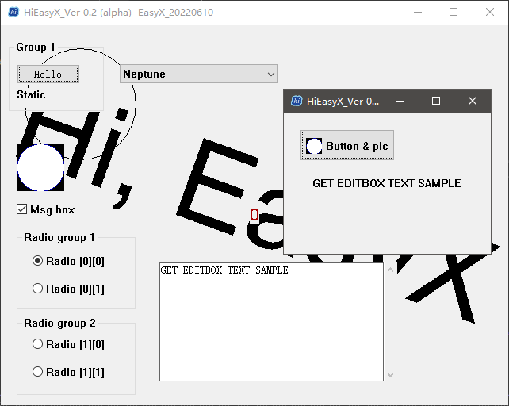
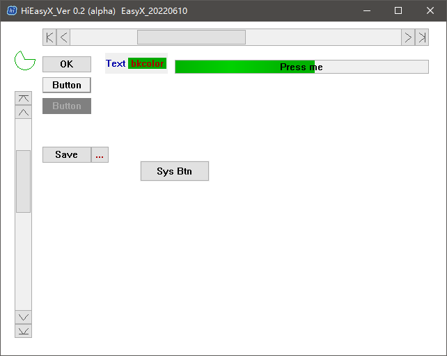

# HiEasyX

[](http://huidong.xyz)
[](https://easyx.cn)


该库基于 EasyX 实现了在窗口、绘图、UI 等诸多方面的全面升级

> [查看教程](./Tutorial.md)

> [更新日志](./Changelog.md)

*前身：[EasyWin32](github.com/zouhuidong/EasyWin32)*

## 支持功能

* HiEasyX
  + HiWindow：窗口支持
    - 支持创建多绘图窗口
    - 支持窗口拉伸
    - 支持 Win32 控件
    - 支持自定义窗口过程函数
    - 支持快速创建托盘
  + HiGUI：自绘控件（未完工）
    - Static
    - Button
    - ProgressCtrl
    - ScrollBar
    - Page
  + HiSysGUI：系统控件封装
    - SysStatic
    - SysButton
    - SysCheckBox
    - SysRadioButton
    - SysGroup
    - SysGroupBox
    - SysEdit
    - SysComboBox
  + HiCanvas：EasyX 绘图函数的 C++ 封装
    - 支持透明通道
    - 和 HiWindow 完美融合
    - 使用更加方便
  + HiGif：动图支持
  + HiMusicMCI：声音 API 封装
  + HiMouseDrag：鼠标拖动消息封装
    
## 编译环境

* Windows 10
* VisualStudio 2022
* EasyX_20220610

> *您必须已经配置 EasyX 图形库，如未配置，请访问图形库官网 https://easyx.cn*

**注意：暂不支持 MingW 和 GCC 编译器，请使用 Visual Studio 编译项目。**

## 配置此库

您可以直接打开仓库中的项目并编译运行。下面是在您的项目中配置此库的方法：

1. 下载仓库到本地
2. 创建一个 Visual Studio 项目
3. 复制仓库项目中的 `./HiEasyX/HiEasyX.h` 和 `./HiEasyX/HiEasyX/` 整个文件夹到您的项目目录下
4. 将刚才复制的文件和文件夹加入到您的 Visual Studio 项目中（拖入 Visual Studio 的项目资源管理器即可）
5. 编写代码，编译运行

> **温馨提示**
> 
> 由于 HiEasyX 源码文件较多，故建议在 Visual Studio 项目资源管理器中创建 HiEasyX 筛选器，将上述文件和文件夹都拖入此筛选器中，这样可以使项目结构更整洁。第一次编译需要编译全部文件，所以耗时较长，后面就不会了。

测试代码：

```cpp
#include "HiEasyX.h"			// 包含 HiEasyX 头文件

int main()
{
	initgraph();			// 初始化窗口

	BEGIN_TASK();			// （不同于 EasyX）启动任务，标识开始绘制

	circle(320, 240, 100);		// 画圆

	END_TASK();			// （不同于 EasyX）完成绘制，结束任务

	FLUSH_DRAW();			// （不同于 EasyX）将绘制内容刷新到屏幕

	getmessage(EM_KEY);		// 任意键退出

	closegraph();			// 关闭窗口
	return 0;
}

```

## 示例程序截屏

以下的示例程序源码可以在 `./Samples/` 中找到

<div align=center>
<br>
<b>Release 模式启动动画效果</b>
</div><br>

<div align=center>
<br>
<b>小球示例（1）</b>
</div><br>

<div align=center>
<br>
<b>小球示例（2）</b>
</div><br>

<div align=center>
<br>
<b>总览多窗口 & Win32 控件 & Canvas 绘图效果</b>
</div><br>

<div align=center>
<br>
<b>系统控件</b>
</div><br>

<div align=center>
<br>
<b>自绘控件</b>
</div><br>

## 立即开始

> [上手 HiEasyX](./Tutorial.md)
