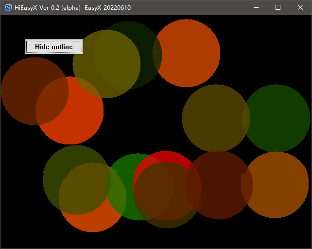
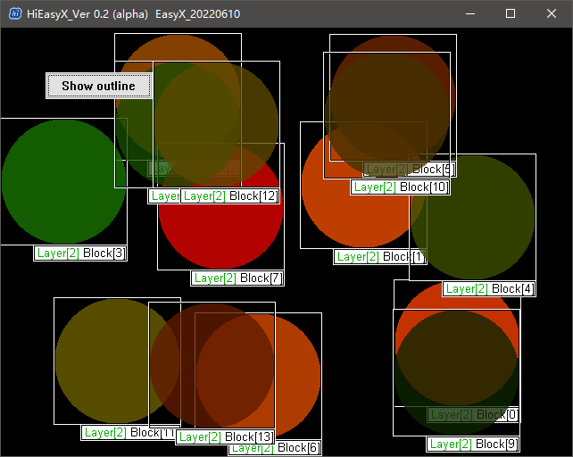
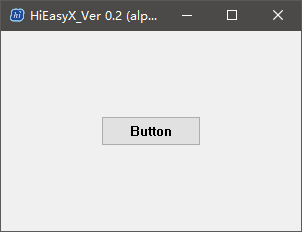
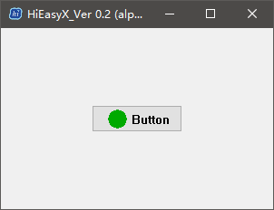
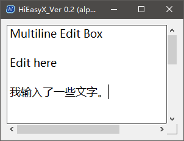
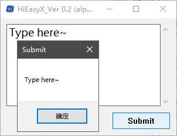
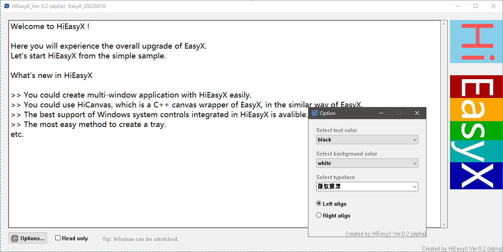

# HiEasyX 快速攻略

## 准备 HiEasyX

### 配置库

请确保您已经在 Visual Studio 项目中配置好 HiEasyX，如果还没有，请看 [README.md](./README.md#配置此库)

推荐使用新版 Visual Studio 编译项目，详见编译环境 [README.md](./README.md#编译环境)

**包含此库**

只需要
```cpp
#include "HiEasyX.h"
```

**命名空间**

HiEasyX 在代码中使用 `HiEasyX` 命名空间，缩写 `hiex`，兼容旧版命名空间 `EasyWin32`。

**库全局设置**

在 `HiDef.h` 中有控制库全局设置的宏定义，可以自行设置，此处不展开。

> **提示：**
>
> HiEasyX 默认在 Release 模式下启用程序开场动画，如需关闭，请在 HiDef.h 中设置。

**原有项目使用 HiEasyX**

HiEasyX 的高兼容性支持您轻松地将原先的 EasyX 项目配置上 HiEasyX。

> [详细教程](#迁移篇在原有-easyx-项目上使用-hieasyx)

### 库函数文档

见 `./doc/index.html`，或在此浏览 [在线版](https://zouhuidong.github.io/HiEasyX)

> 由于在线文档中的有些页面会出现 404，所以建议下载仓库后在本地浏览文档。

## 窗口篇：HiWindow 窗口模块

我们先从一个简单示例开始：

```cpp
#include "HiEasyX.h"			// 包含 HiEasyX 头文件

int main()
{
	initgraph();			// 初始化窗口

	BEGIN_TASK();			// （不同于 EasyX）启动任务，标识开始绘制

	circle(320, 240, 100);		// 画圆

	END_TASK();			// （不同于 EasyX）完成绘制，结束任务

	REDRAW_WINDOW();			// （不同于 EasyX）将绘制内容刷新到屏幕

	getmessage(EM_KEY);		// 任意键退出

	closegraph();			// 关闭窗口
	return 0;
}
```

接下来我为您解释如何使用 HiEasyX。

### 创建绘图窗口

由于 HiEasyX 完全重写了 EasyX 的绘图窗口实现，所以可以支持创建多窗口、拉伸窗口，也支持自定义窗口过程函数。

在 HiEasyx 中，创建、管理窗口的模块名为 `HiWindow`。

创建窗口的正确方式：

```cpp
// 方法 1：直接使用 initgraph，它实际上被宏定义为 HiEasyX 的窗口创建函数
initgraph(640, 480);

// 方法 2：调用 HiEasyX 的窗口创建函数
hiex::initgraph_win32(640, 480);

// 方法 3：使用 HiEasyX 的窗口类创建窗口
hiex::Window wnd(640, 480);

// 也可以这样使用窗口类创建窗口
hiex::Window wnd;
wnd.Create(640, 480);
```

创建窗口时还有一些可选参数，例如窗口名称、窗口属性、过程函数、父窗口句柄，等等。详情请查阅 [文档](https://zouhuidong.github.io/HiEasyX/doxygen/html/class_hi_easy_x_1_1_window.html) 或头文件。

如果想要创建多个窗口，再次调用创建窗口函数即可。

> **想使用原生 EasyX ？**
>
> 在 `HiDef.h` 中定义 `_NATIVE_EASYX_` 宏后，`initgraph` 函数将创建原生的 EasyX 窗口。但是，这也意味着不再支持 HiEasyX 的许多扩展功能。

### 确定窗口是否还存在

EasyX 的用户可能早已习惯不判断绘图窗口是否还存在，因为在 EasyX 中，窗口一旦被关闭，将自动退出程序。

但是 HiEasyX 给您更多的选择。

#### 使用 `initgraph` 创建窗口

所有窗口被关闭后，程序将自动退出。

#### 使用 `hiex::initgraph_win32` 或 `hiex::Window` 创建窗口

所有窗口被关闭后，不会自动退出程序（若创建窗口后调用 `hiex::AutoExit()`，则会自动退出程序）。

您可以随时使用 `hiex::isAnyWindow()` 检测是否还存在任何窗口。

也可以使用 `hiex::isAliveWindow()` 或 `hiex::Window::isAlive()` 检测某一窗口是否存在。

> **特别注意！** 
> 
> 以此方式创建窗口，如果不判断窗口是否关闭，则窗口被关闭后程序会一直在后台运行。

### IMAGE* 的空指针

在原生 EasyX 中，`(IMAGE*)(nullptr)` 代表着绘图窗口的图像指针。但是 `HiWindow` 创建的不是原生 EasyX 窗口，所以不支持 `(IMAGE*)(nullptr)`。

诸如以下函数都默认会传入 `IMAGE* pImg = NULL`：

* `GetImageBuffer`
* `SetWorkingImage`
* `GetImageHDC`

等等。

使用这些函数时，都应该传入具体的图像指针。您可以使用 `GetWoringImage()` 或 `GetWindowImage()` 获取窗口的图像指针。

### 活动窗口的概念

由于 `HiWindow` 支持多窗口，所以操作窗口时要指定目标操作窗口。而 HiEasyX 操作多窗口的逻辑和 EasyX 中的 `SetWorkingImage()` 类似，也就是在操作某个窗口前，将这个窗口设置为活动窗口，然后再对其进行操作。

可以通过 `hiex::SetWorkingWindow()` 设置当前活动窗口，同时，当前工作绘图对象（WorkingImage）也会被设置到活动窗口的 IMAGE 对象。

### 窗口任务

由于 `HiWindow` 支持多窗口和窗口拉伸，所以会导致绘制冲突问题。为了协调冲突，需要在调用 EasyX 绘图函数前，需要标记开启一个窗口任务。

`BEGIN_TASK()` 为当前活动窗口开启窗口任务

`BEGIN_TASK_WND()` 设置某个窗口为活动窗口，再为它开启窗口任务

`END_TASK()` 结束窗口任务，它必须和上述的两个宏之一配套，因为宏内含有不成对的大括号，将宏配套使用才能使大括号匹配。

上面的宏可以这样展开：
```cpp
if (hiex::SetWorkingWindow(_YourWindowHandle_))
{
	if (hiex::BeginTask())
	{
		// 窗口任务内的代码

		hiex::EndTask();
	}
}
```

调用 `getmessage()` 一系列消息获取函数时，无需启动窗口任务，因为它们可以指定获取哪个窗口的消息，不会产生冲突。

> **注意：**
> 
> 尽量将不必要在窗口任务中执行的代码移出窗口任务代码块，因为它们可能会导致窗口任务耗时过长，窗口消息就不能及时被处理，进而引发窗口卡顿或假死。（例如实现延时绘图效果时，`Sleep` 语句不应当放在窗口任务内）
>
> 此外，在两个窗口任务之间插入适当的间隙也很有必要，例如在无限循环的绘制中插入 `Sleep` 语句，这样同时也能降低 CPU 占用率。

### 绘图缓冲

HiEasyX 强制双缓冲，所以无需再调用 EasyX 的 `BeginBatchDraw()` 系列函数

EasyX 原生的 `FlushBatchDraw()` 和 `EndBatchDraw()` 函数都被宏定义为输出绘图缓冲（`hiex::EnforceRedraw()`）

由于绘图代码在窗口任务中执行，故每次窗口任务结束时将默认输出绘图缓冲。

但是，如果不是在窗口过程函数的 `WM_PAINT` 消息中绘图，就还需要在结束窗口任务后调用 `FLUSH_DRAW()` 宏发送窗口重绘消息（它也等同于 `hiex::EnforceRedraw()`），这样才能将绘制内容刷新到屏幕上。

> **注意：**
>
> 由于支持窗口拉伸，缓冲区 `IMAGE` 对象在窗口拉伸时会自动调整大小。如果您保存了缓冲区 `IMAGE` 对象的显存指针，则一定要检测窗口是否被拉伸（使用 `hiex::isWindowSizeChanged()` 或 `hiex::Window::isSizeChanged()`），然后更新显存指针。

### 消息事件

由于 HiEasyX 的窗口是在 HiWindow 中重新实现的，所以 ExMessage 的消息队列也是重新实现的，它现在已经完美兼容 EasyX 的 ExMessage 消息队列了。

所以在 HiEasyX 中，获取鼠标、键盘消息和在 EasyX 中是一样的。由于 HiEasyX 支持多窗口，所以在 HiEasyX 中可能还需要额外指定需要获取哪个窗口的消息。

### 自定义窗口过程函数

为了维护 HiWindow 的正常运行，自定义窗口函数并不是使用 Win32 API 设置窗口的过程函数，您应该使用 `hiex::SetWndProcFunc()` 或 `hiex::Window::SetProcFunc()`。

自定义的过程函数的签名和普通的 Win32 过程函数相同，唯一的区别就是，返回 `DefWindowProc()` 时，改为返回 `HIWINDOW_DEFAULT_PROC` 宏标志。

下面是一段自定义过程函数的示例代码：

```cpp
LRESULT CALLBACK WndProc(HWND hWnd, UINT msg, WPARAM wParam, LPARAM lParam)
{
	switch (msg)
	{
	case WM_PAINT:
		BEGIN_TASK_WND(hWnd);
		circle(100, 100, 70);
		END_TASK();
		break;

	case WM_CLOSE:
		DestroyWindow(hWnd);
		break;

	case WM_DESTROY:
		// TODO: 在此处释放申请的内存
		PostQuitMessage(0);
		break;

	default:
		return HIWINDOW_DEFAULT_PROC;	// 标识使用默认消息处理函数继续处理

		// 若要以默认方式处理，请勿使用此语句
		//return DefWindowProc(hWnd, msg, wParam, lParam);
		break;
	}

	return 0;
}
```

### 创建托盘

这个无需多说，看一个很简单的示例代码即可。

```cpp
#include "HiEasyX.h"

#define IDC_A	101
#define IDC_B	102

void OnTray(UINT id)
{
	BEGIN_TASK();

	switch (id)
	{
	case IDC_A:
		outtextxy(100, 100, L"A");
		break;

	case IDC_B:
		outtextxy(100, 100, L"B");
		break;
	}

	END_TASK();
	FLUSH_DRAW();
}

int main()
{
	hiex::Window wnd;
	wnd.Create();

	wnd.CreateTray(L"Tray Name");

	HMENU hMenu = CreatePopupMenu();
	AppendMenu(hMenu, MF_STRING, IDC_A, L"选项 A");
	AppendMenu(hMenu, MF_SEPARATOR, 0, NULL);			// 分隔符
	AppendMenu(hMenu, MF_STRING, IDC_B, L"选项 B");

	wnd.SetTrayMenu(hMenu);					// 设置菜单
	wnd.SetTrayMenuProcFunc(OnTray);		// 设置菜单响应函数

	hiex::init_end();						// 阻塞等待所有窗口关闭
	DestroyMenu(hMenu);						// 销毁菜单，释放内存
	return 0;
}

```

运行此示例代码，将会在托盘中创建您的程序图标。只要在托盘菜单里面点击某一项，程序就会作出反应。

### 自定义程序图标

HiEasyX 默认为程序加载 HiEasyX 图标。在 EasyX 中，只要在 Visual Studio 项目中加入图标资源，程序就会自动加载您的图标。

在 HiEasyX 中，您加入图标资源后，还需要在第一次创建窗口前调用一次 `hiex::SetCustomIcon()`，即可。

下面列举两种在 Visual Studio 中添加图标资源的方法：

**方法一：** 在资源视图中右键项目 -> 【添加】 -> 【资源】，选择图标资源。

**方法二：** 在项目中创建 resource.h 和 【项目名】.rc。

在 resource.h 中：

```cpp
#define IDI_ICON1	101
```

在 【项目名】.rc 中：

```cpp
#include "resource.h"
IDI_ICON1	ICON	"icon.ico" /* 修改为你的图标文件路径 */
```

然后可以使用如下示例代码测试：

```cpp
#include "resource.h"
#include "HiEasyX.h"

int main()
{
	// 在创建窗口前设置图标
	hiex::SetCustomIcon(MAKEINTRESOURCE(IDI_ICON1), MAKEINTRESOURCE(IDI_ICON1));

	hiex::Window wnd;
	wnd.Create();

	hiex::init_end();
	return 0;
}
```

即可自定义图标。

### 自定义窗口样式

如果您想改变窗口样式，例如取消最大化按钮，禁止用户拉伸窗口，您可以使用 Win32 API `SetWindowLong` 函数，这需要一些 Win32 知识。

还有更简便的方式，直接使用 `hiex::SetWindowStyle()` 或 `hiex::Window::SetStyle()`。

HiEasyX 定义了如下宏用于快速设置窗口样式

`EnableResizing` 设置是否允许窗口拉伸

`EnableSystemMenu` 设置是否启用系统标题栏按钮

`EnableToolWindowStyle` 设置是否启用窗口的工具栏样式

等等。更多请参见 [文档](https://zouhuidong.github.io) 和 `HiWindow.h`。

## 绘图篇：HiCanvas 绘图模块

### 概念

**画布**（`hiex::Canvas`）是对 EasyX 绘图函数的封装和扩展。它的使用方法和 `IMAGE` 对象一样，不同的是，使用画布绘制时不需要 `SetWorkingImage`，可以直接调用对象方法进行绘制，而且它支持透明通道。

**图像块**（`hiex::ImageBlock`）是 `hiex::Canvas` 的扩展，它保存了画布的位置，透明通道信息，可以更方便地存储在图层中。 

**图层**（`hiex::Layer`）中存储有若干个图像块，图层的透明度可以叠加到所有图像块上。

**场景**（`hiex::Scene`）中存储有若干个图层，以及一些特殊图层。渲染整个场景时，可以使图层按次序渲染。

### 使用 Canvas 绘制

您可以创建一个画布对象，然后直接调用它的成员方法进行绘制。它们和 EasyX 原生绘图函数名称很像，区别仅在于它们使用驼峰命名法。

此外，Canvas 还提供一些更方便的绘制方式。例如：调用 Canvas 的绘图函数时可以选择直接设置绘制颜色，直接操作显存绘制或获取像素，支持透明通道的图片加载、缩放、旋转，直接设置字体名称（而不必设置字体大小）、字符（串）的绘制角度，格式化输出文本，等等。 

示例代码：

```cpp
#include "HiEasyX.h"

int main()
{
	hiex::Window wnd(640, 480);			// 创建窗口

	hiex::Canvas canvas(60, 60);		// 创建画布对象

	canvas.Circle(30, 30, 30);			// 绘制画布

	if (wnd.BeginTask())				// 启动窗口任务
	{
		putimage(100, 100, &canvas);	// 将画布内容输出到窗口

		wnd.EndTask();					// 结束窗口任务
		wnd.Redraw();					// 重绘窗口
	}

	hiex::init_end();					// 阻塞等待窗口关闭
	return 0;
}
```

### 使用 Canvas 绑定窗口或 IMAGE 对象

Canvas 还可以和 HiWindow 更好地融合，可以直接将窗口和画布绑定，这样，在绘制时甚至不需要启动窗口任务，直接调用画布的绘制方法即可。例如：

```cpp
#include "HiEasyX.h"

int main()
{
	hiex::Window wnd(640, 480);			// 创建窗口
	hiex::Canvas canvas;				// 创建画布对象

	wnd.BindCanvas(&canvas);			// 将窗口和画布绑定

	canvas.Circle(130, 130, 30);		// 绘制画布对象
	wnd.Redraw();						// 重绘窗口

	hiex::init_end();					// 阻塞等待窗口关闭
	return 0;
}
```

也可以将一个 Canvas 对象绑定到已有的 IMAGE 对象，让 Canvas 为其绘制，只需要：

```cpp
canvas.BindToImage(_Your_Image_Pointer_);
```

> **注意：**
>
> 一旦画布绑定窗口，或者绑定到其他 `IMAGE` 对象，请不要再使用 `&canvas` 的方式获取画布指针，请使用 `hiex::Canvas::GetImagePointer()`，这很重要。

### 应用场景、图层、Alpha 通道

它们都很易于使用，您可以看下面的一个例子：

<div align=center>
<br>
<b>透明通道 - 小球示例（1）</b>
</div><br>

<div align=center>
<br>
<b>透明通道 - 小球示例（2）</b>
</div><br>

示例中，透明小球在窗口中运动，在碰到边界时反弹。

> 为了缩短篇幅，请您在此查看 [源代码](./Samples/Recommend/Balls.cpp)

## 控件篇：使用更完善的 Win32 UI 库

HiEasyX 封装了常用 Win32 控件，这个控件模块被称为 HiSysGUI。

目前支持的控件类型 *（此文档可能更新不及时）* ：

* 分组框
* 静态文本（图像）
* 按钮
* 复选框
* 单选框
* 编辑框
* 组合框

一般情况下，这些控件已经足够。而且，您也可以自定义窗口过程函数，直接调用其它 Win32 控件。

### 体验 HiSysGUI 的极速构建

请看这个例子：

```cpp
#include "HiEasyX.h"

int main()
{
	hiex::Window wnd(300, 200);

	hiex::SysButton btn(wnd.GetHandle(), 100, 85, 100, 30, L"Button");

	hiex::init_end();
	return 0;
}
```

<div align=center>
<br>
<b>创建按钮</b>
</div><br>

没错！使用按钮就是这么容易。

还可以在按钮中添加图片，像这样：

```cpp
#include "HiEasyX.h"

int main()
{
	hiex::Window wnd(300, 200);
	hiex::SysButton btn(wnd.GetHandle(), 100, 85, 100, 30, L"Button");

	// 创建画布，绘制绿色填充圆
	hiex::Canvas canvas(30, 22);
	canvas.Clear(true, 0xe1e1e1);
	canvas.SolidCircle(15, 10, 10, true, GREEN);

	// 添加按钮图像
	btn.Image(true, &canvas, true);

	hiex::init_end();
	return 0;
}
```

<div align=center>
<br>
<b>添加按钮图片</b>
</div><br>

> **提示：**
> 
> 代码中使用了 Canvas 绘制按钮图像，如果使用 IMAGE 同样可以。

如果要响应按钮消息，可以使用 `RegisterMessage` 方法，或者使用 `GetClickCount` 函数获取按钮点击次数。

例如，使用 `GetClickCount` 函数获取按钮点击次数：

```cpp
#include "HiEasyX.h"

int main()
{
	hiex::Window wnd(300, 200);

	hiex::SysButton btn(wnd.GetHandle(), 100, 85, 100, 30, L"Button");
	
	// 窗口存在时，程序才保持运行
	while (wnd.isAlive())
	{
		// 如果按钮的点击次数不为 0，说明用户已点击按钮
		if (btn.GetClickCount())
		{
			// 处理点击消息
		}

		Sleep(50);
	}

	return 0;
}
```

或者注册点击消息：

```cpp
#include "HiEasyX.h"

void OnBtn()
{
	// 在此处理点击消息
}

int main()
{
	hiex::Window wnd(300, 200);

	hiex::SysButton btn(wnd.GetHandle(), 100, 85, 100, 30, L"Button");
	
	btn.RegisterMessage(OnBtn);	// 注册点击消息

	hiex::init_end();
	return 0;
}
```

其余控件的使用方式大同小异，可以看看相应的头文件介绍。此处再举一例，创建编辑框。

像这样：

```cpp
#include "HiEasyX.h"

int main()
{
	hiex::Window wnd(300, 200);
	hiex::SysEdit edit;	// 编辑框

	// 预设样式为支持多行输入，因为有的控件样式必须在创建之前就指定
	edit.PreSetStyle(true, false, true, true, true, true);
	edit.Create(wnd.GetHandle(), 10, 10, 280, 180, L"Multiline Edit Box\r\n\r\nEdit here");

	// 设置编辑框字体
	edit.SetFont(24, 0, L"微软雅黑");

	hiex::init_end();
	return 0;
}
```

<div align=center>
<br>
<b>创建编辑框</b>
</div><br>

加上按钮，获取文本：

```cpp
#include "HiEasyX.h"

int main()
{
	hiex::Window wnd(300, 200);

	// 编辑框
	hiex::SysEdit edit;
	edit.PreSetStyle(true, false, true, true);
	edit.Create(wnd.GetHandle(), 10, 10, 280, 140, L"Type here~");
	edit.SetFont(24, 0, L"微软雅黑");

	// 按钮
	hiex::SysButton btn;
	btn.Create(wnd.GetHandle(), 190, 160, 100, 30,L"Submit");

	while (wnd.isAlive())
	{
		// 按下按钮时，弹窗显示输入的文本
		if (btn.isClicked())
			MessageBox(wnd.GetHandle(), edit.GetText().c_str(), L"Submit", MB_OK);
		Sleep(50);
	}

	return 0;
}
```

<div align=center>
<br>
<b>获取编辑框文本</b>
</div><br>

还可以设置文字颜色、背景颜色、密码框、左中右对齐方式、仅数字输入、禁用控件，等等，不一一列举。这个教程不可能面面俱到，也有可能更新延迟，如果您想具体了解每个控件，可以看看它们的声明，此处不再展开。

> 参阅 [文档](https://zouhuidong.github.io/HiEasyX/doxygen/html/class_hi_easy_x_1_1_sys_control_base.html)。

下面这个示例用到的控件比较全面，可以帮您更深入地了解 HiSysGUI：

<div align=center>
<br>
<b>控件示例</b>
</div><br>

> 在此查看此示例的 [源代码](./Samples/Recommend/OverviewSample.cpp)

## 迁移篇：在原有 EasyX 项目上使用 HiEasyX

> 要在原有项目上应用 HiEasyX 并非难事，最主要的改动就是在每个绘图代码块前后写上开启和关闭窗口任务的代码。

### Step 1: 改头文件

首先确保您已在项目中配置 HiEasyX。

然后，只需要将

```cpp
#include <easyx.h>
```

或

```cpp
#include <graphics.h>
```

改为

```cpp
#include "HiEasyX.h"
```

### Step 2: 标识窗口任务

如果原项目中使用了双缓冲，则一定会调用 `FlushBatchDraw` 函数，这样就能更方便地找出每个绘图代码块了，否则就需要将每个绘图代码块手动找出来。

只要在绘图代码块的前后分别加上：

```cpp
BEGIN_TASK();
```

和

```cpp
END_TASK();
```

即可。窗口任务相关内容已在前文交代清楚，故不再重复。注意不要将不必要的代码也放入窗口任务中，详见 [上文](#窗口任务)。

## 常见问题整合

* 创建窗口后没有判断窗口是否被关闭
* 调用 EasyX 库函数没有启动窗口任务
* 在程序主循环中读取鼠标操作卡顿。可能是使用了 `if` 语句读取，应改为使用 `while`，一次读完所有消息
* 向 EasyX 库函数传入空的 IMAGE 指针来代指窗口画布，应使用 `GetWorkingImage()` 获取窗口画布地址
* 窗口响应卡顿，可能是因为窗口任务中存在不必要的延时代码（如 `Sleep` 语句）、耗时的计算、死循环等等，或在两个任务之间几乎无间隙
* `BEGIN_TASK()` 有极小概率启动任务失败，如果失败，窗口任务中的代码将不会被执行。如果代码没有成功执行会对后续代码运行产生影响，则应当使用 `BEGIN_TASK()` 宏的展开形式，判断是否启动任务成功

### Release 模式的程序启动动画

HiEasyX 默认在 Release 模式下开启程序启动动画，此动画改编自慢羊羊的《艺术字系列：冰封的 EasyX》。如需关闭，请在 `HiDef.h` 中按照注释指示定义相应的宏取消开场动画。

## 结语

HiEasyX 还有一些实用但零碎的功能，在此恐不能详述。例如：

* `HiMacro.h` 宏定义相关
* `HiFunc.h` HiEasyX 常用杂项函数
* `HiFPS.h` 帧率相关
* `HiDrawingProperty.h` 保存绘图属性功能
* `HiMouseDrag.h` 更方便快捷地处理鼠标拖动消息
* `HiMusicMCI.h` 声音相关
* `HiGif.h` 动图相关

如您感兴趣，可以自行查阅头文件和文档。
